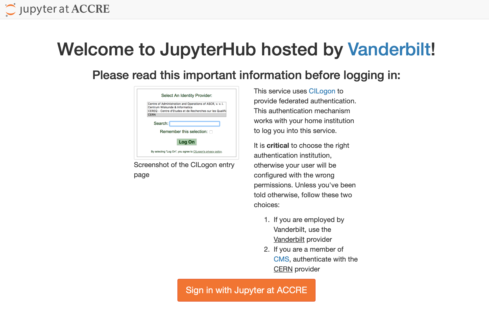
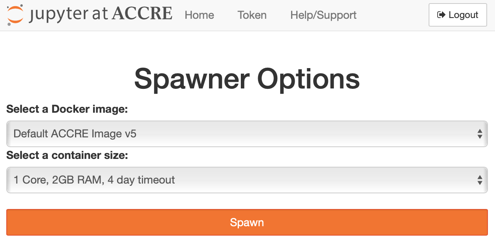
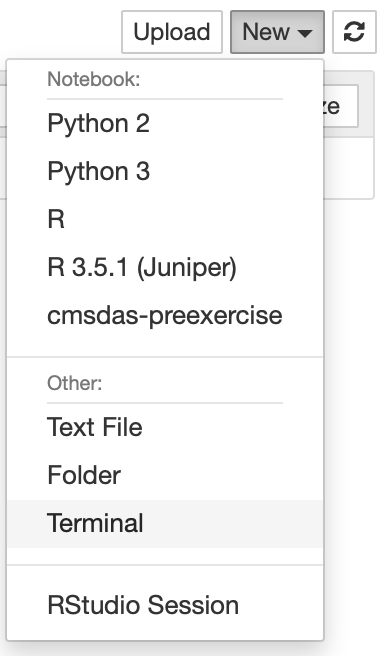

# pyROOTforCMSDAS
Files for the pyROOT exercise with CMSDAS.

## Setup

We will be using the Jupyter instance at Vanderbilt. Point your browser to:

[https://jupyter.accre.vanderbilt.edu/](https://jupyter.accre.vanderbilt.edu/)

If this is the first time using this JupyterHub, you should see:

<p align="center">
  
</p>

Click the "Sign in with Jupyter at ACCRE" button. On the following page, select CERN as your identity provider and click the "Log On" button. Then, enter your CERN credentials or use your CERN grid certificate to autheticate.

On the following page, you will have the option to select which disk image to boot.  Select the default (presently v5) image and single core machine and click "Spawn".

<p align="center">
  
</p>

Now you should see the JupyterHub home directory. Click on "New" then "Terminal" in the top right to launch a new terminal.

<p align="center">
  
</p>

To download the tutorials, type

```
git clone https://github.com/FNALLPC/pyROOTforCMSDAS
```

Now you may end the terminal session by typing "exit", close the tab, and return to your directory tab.  There should be a new directory present called `pyROOTforCMSDAS`, where you may find all of the tutorials and exercises.

To setup your environment for the exercises, first click to open the "setupLibraries.ipynb".  Once you have followed the instructions there, open "exercises.ipynb".